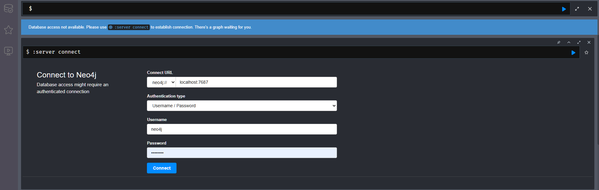
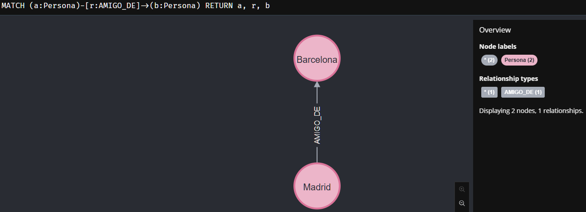
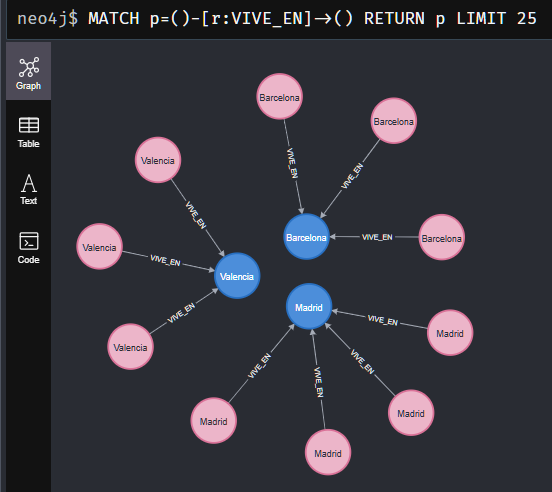

# Configuración de Neo4j


Guía rápida para configurar y administrar Neo4j en local o contenedores.

## Tabla de Contenidos

- [Configuración de Neo4j](#configuración-de-neo4j)
  - [Tabla de Contenidos](#tabla-de-contenidos)
  - [Prerrequisitos](#prerrequisitos)
  - [Paso 1: Crear un Archivo Docker Compose](#paso-1-crear-un-archivo-docker-compose)
    - [Explicación de variables de entorno y configuración](#explicación-de-variables-de-entorno-y-configuración)
  - [Paso 2: Desplegar Neo4j con Docker Compose](#paso-2-desplegar-neo4j-con-docker-compose)
    - [Gestión rápida con Makefile](#gestión-rápida-con-makefile)
    - [Acceso a Neo4j](#acceso-a-neo4j)
  - [Ejemplo funcional](#ejemplo-funcional)
    - [Crear nodos con atributos](#crear-nodos-con-atributos)
    - [Crear relaciones entre nodos](#crear-relaciones-entre-nodos)
    - [Consultar nodos y relaciones](#consultar-nodos-y-relaciones)
    - [Actualizar atributos de un nodo](#actualizar-atributos-de-un-nodo)
    - [Eliminar nodos y relaciones](#eliminar-nodos-y-relaciones)
  - [Buenas prácticas y recomendaciones](#buenas-prácticas-y-recomendaciones)
    - [¿Qué es APOC y para qué sirve?](#qué-es-apoc-y-para-qué-sirve)
  - [Comandos útiles](#comandos-útiles)
    - [Acceder al contenedor Neo4j](#acceder-al-contenedor-neo4j)
    - [Acceder a la consola Cypher (CLI)](#acceder-a-la-consola-cypher-cli)
    - [Exportar una base de datos (dump)](#exportar-una-base-de-datos-dump)
    - [Importar una base de datos (dump)](#importar-una-base-de-datos-dump)
  - [Configuración clave](#configuración-clave)
  - [Integración con Python y Java](#integración-con-python-y-java)
    - [Python](#python)
    - [Java](#java)
  - [Recomendaciones](#recomendaciones)
  - [Enlaces útiles](#enlaces-útiles)
  - [Volver a su ficha](#volver-a-su-ficha)

## Prerrequisitos

Antes de comenzar, asegúrate de lo siguiente:

- **Docker** está instalado y en ejecución.
- **Docker Compose** está instalado (se recomienda la versión 2.29.x o superior). Verifica con:

> Puedes utilizar el script de `docker_install.sh` de la carpeta `/resources` para instalar ambas cosas en WSL/Ubuntu.

- Tienes suficiente espacio en disco para los logs de Kafka (al menos 1GB para pruebas).
- Los puertos `2181` (Zookeeper), `9092` (broker de Kafka) y `29092` (acceso externo) están disponibles en tu máquina.

## Paso 1: Crear un Archivo Docker Compose

El fichero pregenerado se encuentra en `resources/bbdd/neo4j/`:

docker-compose.yml

```yaml
services:
  neo4j:
    image: neo4j:5.19
    container_name: neo4j
    ports:
      - "7474:7474"   # Neo4j Browser (web)
      - "7687:7687"   # Bolt protocol (drivers)
    environment:
      NEO4J_AUTH: "neo4j/password"  # usuario/contraseña por defecto
      NEO4J_dbms_memory_pagecache_size: 1G
      NEO4J_dbms_memory_heap_initial__size: 1G
      NEO4J_dbms_memory_heap_max__size: 2G
      NEO4J_PLUGINS: '["apoc"]'   # Plugin APOC para utilidades avanzadas
    volumes:
      - neo4j_data:/data
      - neo4j_logs:/logs
      - neo4j_import:/var/lib/neo4j/import
      - neo4j_plugins:/plugins
    restart: unless-stopped
volumes:
  neo4j_data:
  neo4j_logs:
  neo4j_import:
  neo4j_plugins:
```

### Explicación de variables de entorno y configuración

- `NEO4J_AUTH`: Usuario y contraseña inicial (formato `usuario/contraseña`).
- `NEO4J_dbms_memory_pagecache_size`: Tamaño de caché de página para mejorar el rendimiento de lectura.
- `NEO4J_dbms_memory_heap_initial__size` y `NEO4J_dbms_memory_heap_max__size`: Memoria heap mínima y máxima de la JVM.
- `NEO4J_PLUGINS`: Plugins adicionales a instalar (por defecto, APOC).
- Volúmenes:
  - `neo4j_data`: Datos persistentes.
  - `neo4j_logs`: Logs del sistema.
  - `neo4j_import`: Carpeta para importar datos.
  - `neo4j_plugins`: Plugins externos.

Puedes modificar estos valores según las necesidades del entorno de desarrollo o pruebas.

## Paso 2: Desplegar Neo4j con Docker Compose

Inicia los contenedores de Neo4j usando Docker Compose.

```bash
docker-compose up -d
```

- **Explicación**:
  - El flag `-d` ejecuta los contenedores en segundo plano.
  - Verifica que los contenedores estén en ejecución:

    ```bash
    docker ps
    ```

    Deberías ver un contenedor: `neo4j`.

---

### Gestión rápida con Makefile

En la carpeta `resources/bbdd/neo4j/` tienes un `Makefile` preparado para gestionar Neo4j fácilmente:

```makefile
NEO4J_COMPOSE=docker-compose.yml

up:
    docker compose -f $(NEO4J_COMPOSE) up -d

down:
    docker compose -f $(NEO4J_COMPOSE) down

restart:
    docker compose -f $(NEO4J_COMPOSE) restart

logs:
    docker compose -f $(NEO4J_COMPOSE) logs -f
```

Ejecuta los siguientes comandos desde esa carpeta:

- Levantar Neo4j:

  ```bash
  make up
  ```

- Parar Neo4j:

  ```bash
  make down
  ```

- Reiniciar Neo4j:

  ```bash
  make restart
  ```

- Ver logs:

  ```bash
  make logs
  ```

> **Nota:** Para usar los comandos `make`, asegúrate de tener instalado el paquete `make`.
> Puedes instalarlo en sistemas basados en Debian/Ubuntu con:

```bash
sudo apt install make
```

### Acceso a Neo4j

- Navegador web: [http://localhost:7474/](http://localhost:7474/)

  

- Usuario: `neo4j`
- Contraseña: `password` (o la que definas en `NEO4J_AUTH`)

## Ejemplo funcional

### Crear nodos con atributos

```cypher
CREATE (p:Persona {nombre: 'Juan', edad: 30, ciudad: 'Madrid'})

CREATE (p2:Persona {nombre: 'Ana', edad: 28, ciudad: 'Barcelona'})
```

### Crear relaciones entre nodos

```cypher
MATCH (a:Persona {nombre: 'Juan'}), (b:Persona {nombre: 'Ana'})
CREATE (a)-[:AMIGO_DE]->(b)
```

### Consultar nodos y relaciones

```cypher
MATCH (p:Persona) RETURN p

MATCH (a:Persona)-[r:AMIGO_DE]->(b:Persona) RETURN a, r, b
```

  

### Actualizar atributos de un nodo

```cypher
MATCH (p:Persona {nombre: 'Juan'})
SET p.edad = 31
RETURN p
```

### Eliminar nodos y relaciones

```cypher
MATCH (p:Persona {nombre: 'Ana'})
DETACH DELETE p
```

---

## Buenas prácticas y recomendaciones

- No uses contraseñas por defecto en entornos productivos.
- Ajusta la memoria según el tamaño de tus datos.
- Usa volúmenes para persistencia y backup.
- Habilita plugins solo si los necesitas (ej. APOC).
- Usa la carpeta `import` para cargas masivas de datos.

---

### ¿Qué es APOC y para qué sirve?

**APOC** (Awesome Procedures On Cypher) es una colección de procedimientos y funciones avanzadas para Neo4j que amplía enormemente las capacidades de Cypher. Permite realizar tareas de integración, transformación de datos, generación de grafos, utilidades de import/export, manipulación de cadenas, fechas, colecciones y mucho más.

**Algunas utilidades comunes:**

- Importar/exportar datos desde/para CSV, JSON, XML, etc.
- Generar grafos sintéticos o de ejemplo.
- Manipular nodos, relaciones y propiedades de forma masiva.
- Consultas avanzadas de grafos, path finding, shortest path, etc.
- Llamar APIs externas o ejecutar código JavaScript desde Cypher.

**Ejemplo práctico de uso de APOC:**

Crear relaciones entre personas de la misma ciudad.

Crear nodos Persona:

```cypher
CREATE
  (p1:Persona {nombre: 'Juan', edad: 30, ciudad: 'Madrid', profesion: 'Ingeniero', email: 'juan@email.com', genero: 'M', empresa: 'TechCorp'}),
  (p2:Persona {nombre: 'Ana', edad: 28, ciudad: 'Barcelona', profesion: 'Doctora', email: 'ana@email.com', genero: 'F', empresa: 'TechCorp'}),
  (p3:Persona {nombre: 'Luis', edad: 35, ciudad: 'Madrid', profesion: 'Profesor', email: 'luis@email.com', genero: 'M', empresa: 'TechCorp'}),
  (p4:Persona {nombre: 'María', edad: 27, ciudad: 'Valencia', profesion: 'Diseñadora', email: 'maria@email.com', genero: 'F', empresa: 'TechCorp'}),
  (p5:Persona {nombre: 'Carlos', edad: 40, ciudad: 'Barcelona', profesion: 'Abogado', email: 'carlos@email.com', genero: 'M', empresa: 'TechCorp'}),
  (p6:Persona {nombre: 'Lucía', edad: 32, ciudad: 'Madrid', profesion: 'Periodista', email: 'lucia@email.com', genero: 'F', empresa: 'TechCorp'}),
  (p7:Persona {nombre: 'Elena', edad: 29, ciudad: 'Valencia', profesion: 'Arquitecta', email: 'elena@email.com', genero: 'F', empresa: 'TechCorp'}),
  (p8:Persona {nombre: 'Miguel', edad: 31, ciudad: 'Madrid', profesion: 'Analista', email: 'miguel@email.com', genero: 'M', empresa: 'TechCorp'}),
  (p9:Persona {nombre: 'Sergio', edad: 36, ciudad: 'Barcelona', profesion: 'Chef', email: 'sergio@email.com', genero: 'M', empresa: 'TechCorp'}),
  (p10:Persona {nombre: 'Patricia', edad: 33, ciudad: 'Valencia', profesion: 'Psicóloga', email: 'patricia@email.com', genero: 'F', empresa: 'TechCorp'});
```

Crear nodos Ciudad:

```cypher
MATCH (p:Persona)
WITH DISTINCT p.ciudad AS nombreCiudad
MERGE (:Ciudad {nombre: nombreCiudad})
```

Crear relaciones entre Persona y su Ciudad:

```cypher
CALL apoc.periodic.iterate(
  "
  MATCH (p:Persona)
  RETURN p
  ",
  "
  MATCH (c:Ciudad {nombre: p.ciudad})
  MERGE (p)-[:VIVE_EN]->(c)
  ",
  {batchSize:100, parallel:false}
)
```

- Salida:

  

> **Nota:** Se puede realizar sin el plugin APOC, pero es menos eficiente cuando se trata de relaciones entre nodos con mucha cantidad de relaciones.

Otro ejemplo: importar datos desde un archivo CSV ubicado en el volumen `import`:

```cypher
CALL apoc.load.csv('personas.csv') YIELD map AS row
CREATE (p:Persona {nombre: row.nombre, edad: toInteger(row.edad), ciudad: row.ciudad})
```

## Comandos útiles

### Acceder al contenedor Neo4j

```bash
docker exec -it neo4j bash
```

### Acceder a la consola Cypher (CLI)

```bash
cypher-shell -u neo4j -p password
```

### Exportar una base de datos (dump)

```bash
neo4j-admin dump --database=neo4j --to=backup.dump
```

### Importar una base de datos (dump)

```bash
neo4j-admin load --from=backup.dump --database=neo4j --force
```

## Configuración clave

- **NEO4J_AUTH**: Define el usuario y la contraseña (formato `usuario/contraseña`).
- **ports**: Mapea los puertos 7474 (HTTP para la interfaz web) y 7687 (Bolt para conexiones de clientes).
- **volumes**: Almacena datos y logs en volúmenes persistentes (`neo4j_data` y `neo4j_logs`).

---

## Integración con Python y Java

### Python

1. **Instala el driver oficial:**

   ```bash
   pip install neo4j
   ```

2. **Ejemplo de conexión y consulta:**

   ```python
   from neo4j import GraphDatabase

   uri = "bolt://localhost:7687"
   user = "neo4j"
   password = "password"
   driver = GraphDatabase.driver(uri, auth=(user, password))

   def crear_persona(tx, nombre, edad):
       tx.run("CREATE (p:Persona {nombre: $nombre, edad: $edad})", nombre=nombre, edad=edad)

   with driver.session() as session:
       session.write_transaction(crear_persona, "Pedro", 25)
       result = session.run("MATCH (p:Persona) RETURN p.nombre AS nombre, p.edad AS edad")
       for record in result:
           print(record["nombre"], record["edad"])

   driver.close()
   ```

   Más información: [Neo4j Python Driver Docs](https://neo4j.com/docs/api/python-driver/current/)

### Java

1. **Añade la dependencia Maven:**

   ```xml
   <dependency>
     <groupId>org.neo4j.driver</groupId>
     <artifactId>neo4j-java-driver</artifactId>
     <version>5.28.7</version>
   </dependency>
   ```

2. **Ejemplo de conexión y consulta:**

   ```java
   import org.neo4j.driver.AuthTokens;
   import org.neo4j.driver.Driver;
   import org.neo4j.driver.GraphDatabase;
   import org.neo4j.driver.Session;
   import org.neo4j.driver.Result;

   public class Neo4jExample {
       public static void main(String[] args) {
           Driver driver = GraphDatabase.driver(
               "bolt://localhost:7687",
               AuthTokens.basic("neo4j", "password")
           );

           try (Session session = driver.session()) {
               session.writeTransaction(tx -> tx.run(
                   "CREATE (p:Persona {nombre: $nombre, edad: $edad})",
                   org.neo4j.driver.Values.parameters("nombre", "Sonia", "edad", 29)
               ));

               Result result = session.run("MATCH (p:Persona) RETURN p.nombre AS nombre, p.edad AS edad");
               while (result.hasNext()) {
                   var record = result.next();
                   System.out.println(record.get("nombre").asString() + " " + record.get("edad").asInt());
               }
           }
           driver.close();
       }
   }
   ```

   Más información: [Neo4j Java Driver Docs](https://neo4j.com/docs/java-manual/current/)

---

## Recomendaciones

- Usa el protocolo Bolt para conexiones de alto rendimiento.
- Configura índices en propiedades de nodos y relaciones para optimizar consultas Cypher.
- Habilita la autenticación y usa SSL en producción.
- Integra con Kafka Connect usando conectores como `streams.kafka.connect.sink.Neo4jSinkConnector` para sincronización de datos.
- Evita nodos con demasiadas relaciones ("super nodos") para mejorar el rendimiento.

## Enlaces útiles

- [Sitio oficial de Neo4j](https://neo4j.com/)
- [Documentación de Neo4j](https://neo4j.com/docs/)

## Volver a su ficha

[Volver a la ficha de Neo4j](../../tecnologias/bbdd/neo4j.md)
