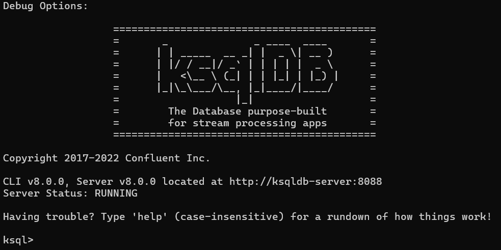
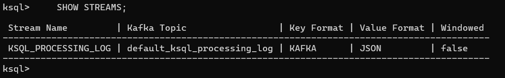
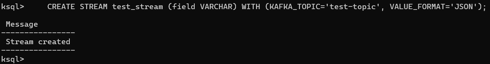
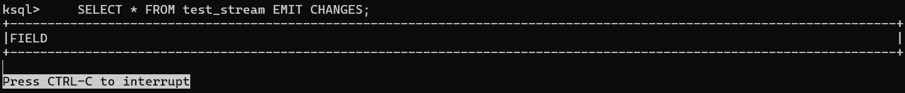
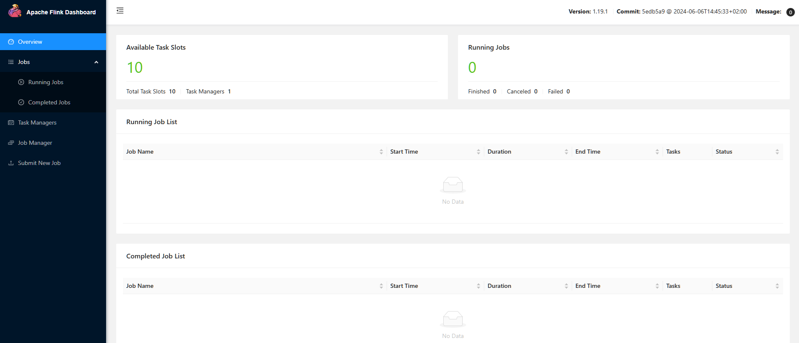
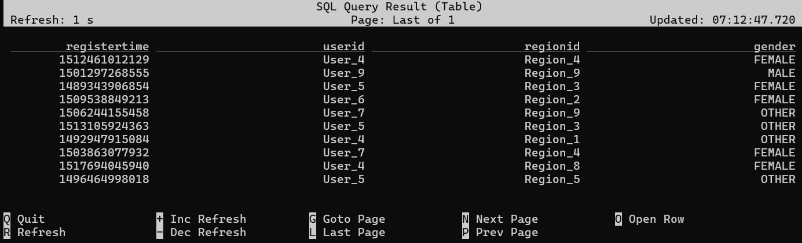

# Configuración de Apache Kafka en Contenedores


Esta guía proporciona instrucciones detalladas para instalar y desplegar Apache Kafka en un contenedor Docker, asegurando compatibilidad en todas las plataformas (Linux, macOS, Windows, incluyendo WSL).

## Tabla de Contenidos

- [Configuración de Apache Kafka en Contenedores](#configuración-de-apache-kafka-en-contenedores)
  - [Tabla de Contenidos](#tabla-de-contenidos)
  - [Prerrequisitos](#prerrequisitos)
  - [Despliegue de Kafka (modo KRaft)](#despliegue-de-kafka-modo-kraft)
    - [1. Clona el repositorio y usa el compose community](#1-clona-el-repositorio-y-usa-el-compose-community)
    - [2. Levanta los servicios](#2-levanta-los-servicios)
  - [Verificar el Despliegue](#verificar-el-despliegue)
  - [Consejos y recomendaciones](#consejos-y-recomendaciones)
  - [Recursos Adicionales](#recursos-adicionales)
  - [Componentes del Docker Compose de Confluent Community](#componentes-del-docker-compose-de-confluent-community)
    - [¿Para qué sirve cada uno y cómo usarlos?](#para-qué-sirve-cada-uno-y-cómo-usarlos)
      - [1. **broker**](#1-broker)
      - [2. **schema-registry**](#2-schema-registry)
      - [3. **connect** (Kafka Connect + Datagen)](#3-connect-kafka-connect--datagen)
      - [4. **rest-proxy**](#4-rest-proxy)
      - [5. **ksqldb-server** y **ksqldb-cli**](#5-ksqldb-server-y-ksqldb-cli)
      - [6. **ksql-datagen**](#6-ksql-datagen)
      - [7. **flink-jobmanager**, **flink-taskmanager**, **flink-sql-client**](#7-flink-jobmanager-flink-taskmanager-flink-sql-client)
  - [Ejemplo de flujo de trabajo usando varios servicios](#ejemplo-de-flujo-de-trabajo-usando-varios-servicios)
  - [Recursos útiles](#recursos-útiles)
  - [Volver a su ficha](#volver-a-su-ficha)

## Prerrequisitos

Antes de comenzar, asegúrate de lo siguiente:

- **Docker** está instalado y en ejecución.
- **Docker Compose** está instalado (se recomienda la versión 2.29.x o superior). Verifica con:

> Puedes utilizar el script de `docker_install.sh` de la carpeta `/resources` para instalar ambas cosas en WSL/Ubuntu.

- Tienes suficiente espacio en disco para los logs de Kafka (al menos 1GB para pruebas).
- Los puertos principales (ver tabla más abajo) están disponibles en tu máquina.

## Despliegue de Kafka (modo KRaft)

Desde 2023, Kafka soporta el modo KRaft (Kafka Raft Metadata mode). El método recomendado es usar el repositorio oficial de Confluent:

[https://github.com/confluentinc/cp-all-in-one](https://github.com/confluentinc/cp-all-in-one)

### 1. Clona el repositorio y usa el compose community

```bash
git clone https://github.com/confluentinc/cp-all-in-one.git
cd cp-all-in-one/cp-all-in-one-community
```

### 2. Levanta los servicios

```bash
docker compose up -d
```

Esto desplegará:

- **Kafka Broker**
- **Schema Registry**
- **Kafka Connect**
- **ksqlDB**
- **Control Center**
- **REST Proxy**
- **Flink Job Manager**

Puedes editar el `docker-compose.yml` para quitar servicios que no necesites.

---

## Verificar el Despliegue

- Revisa los logs de los contenedores:

  ```bash
  docker compose logs kafka
  docker compose logs schema-registry
  ```

---

## Consejos y recomendaciones

- Puedes eliminar servicios del `docker-compose.yml` si solo necesitas Kafka puro.
- Para producción, revisa la persistencia de volúmenes y la configuración de redes.
- Consulta la [guía oficial de KRaft](https://kafka.apache.org/documentation/#kraft) para detalles avanzados.
- Para desarrollo, puedes usar los servicios auxiliares (Schema Registry, Connect, etc.) según tus necesidades.

## Recursos Adicionales

- [Repositorio cp-all-in-one (Confluent)](https://github.com/confluentinc/cp-all-in-one)
- [Documentación oficial de Kafka](https://kafka.apache.org/documentation/)

---

## Componentes del Docker Compose de Confluent Community

| Servicio           | Imagen Docker                                         | Propósito principal                                                                                       | Puerto(s) principales |
|--------------------|------------------------------------------------------|----------------------------------------------------------------------------------------------------------|----------------------|
| broker             | confluentinc/cp-kafka                                | Broker de Kafka: gestiona topics, mensajes, particiones, etc.                                            | 9092, 9101           |
| schema-registry    | confluentinc/cp-schema-registry                      | Gestión de esquemas Avro/JSON/Protobuf para los mensajes de Kafka.                                       | 8081                 |
| connect            | cnfldemos/kafka-connect-datagen                      | Integración de Kafka con sistemas externos (bases de datos, ficheros, etc.) y generación de datos demo.  | 8083                 |
| rest-proxy         | confluentinc/cp-kafka-rest                           | API REST para interactuar con Kafka sin necesidad de librerías Java.                                     | 8082                 |
| ksqldb-server      | confluentinc/cp-ksqldb-server                        | Motor de SQL streaming sobre Kafka (KSQL).                                                               | 8088                 |
| ksqldb-cli         | confluentinc/cp-ksqldb-cli                           | CLI para interactuar con ksqlDB Server.                                                                  | -                    |
| ksql-datagen       | confluentinc/ksqldb-examples                         | Generador de datos de ejemplo para pruebas en ksqlDB.                                                    | -                    |
| flink-jobmanager   | cnfldemos/flink-kafka                                | Apache Flink: procesamiento de streams y batch en tiempo real.                                           | 8081, 9081, 6123     |
| flink-taskmanager  | cnfldemos/flink-kafka                                | Ejecuta tareas de Flink (workers).                                                                       | 8081, 6123           |
| flink-sql-client   | cnfldemos/flink-sql-client-kafka                     | CLI para ejecutar consultas SQL sobre Flink.                                                             | 8081, 6123           |

---

### ¿Para qué sirve cada uno y cómo usarlos?

#### 1. **broker**

- **Propósito**: Servidor de Kafka que maneja el almacenamiento y la transmisión de mensajes.
- **Imagen**: `confluentinc/cp-kafka`
- **Puerto**: 9092
- **Uso**:
  - **Crear un topic**:

    ```bash
    sudo docker compose exec broker kafka-topics --create \
      --bootstrap-server localhost:9092 \
      --topic test-topic \
      --partitions 1 \
      --replication-factor 1
    ```

    - **Salida**:

      ```bash
      Created topic test-topic.
      ```

  - **Listar topics**:

    ```bash
    sudo docker compose exec broker kafka-topics --list --bootstrap-server localhost:9092
    ```

    - **Salida**:

      ```bash
      test-topic
      ```

  - **Producir mensajes** (CLI):

    ```bash
    sudo docker compose exec -it broker kafka-console-producer \
      --bootstrap-server localhost:9092 \
      --topic test-topic
    ```

    - Escribe mensajes y pulsa Enter para enviarlos. Usa Ctrl+C para salir.

  - **Consumir mensajes** (CLI):

    ```bash
    sudo docker compose exec -it broker kafka-console-consumer \
      --bootstrap-server localhost:9092 \
      --topic test-topic \
      --from-beginning
    ```

  - **Ver detalles de un topic**:

    ```bash
    sudo docker compose exec broker kafka-topics --describe \
      --bootstrap-server localhost:9092 \
      --topic test-topic
    ```

  - **Eliminar un topic**:

    ```bash
    sudo docker compose exec broker kafka-topics --delete \
      --bootstrap-server localhost:9092 \
      --topic test-topic
    ```

    - **Nota**: La eliminación de topics debe estar habilitada en la configuración del broker.

  - **Ver mensajes en un topic** (sin consumirlos):

    ```bash
    sudo docker compose exec -T broker kafka-console-consumer \
      --bootstrap-server localhost:9092 \
      --topic test-topic \
      --from-beginning
    ```

#### 2. **schema-registry**

- **Propósito**: Permite registrar y validar esquemas de los mensajes (Avro, JSON Schema, Protobuf).
- **Imagen**: `confluentinc/cp-schema-registry`
- **Puerto**: 8081
- **Uso**:  
  - Registrar y consultar esquemas vía API REST.
  - Ejemplo: Registrar un esquema Avro (usando curl):

    ```bash
    curl -X POST -H "Content-Type: application/vnd.schemaregistry.v1+json" \
      --data '{"schema": "{\"type\":\"string\"}"}' \
      http://localhost:8081/subjects/test-topic-value/versions
    ```

  - Consultar esquemas:

    ```bash
    curl http://localhost:8081/subjects
    ```

    - **Salida** (después de registrar el esquema):

      ```json
      {
        "id": 1
      }
      ```

      Esto devuelve el ID del esquema recién creado.

  - Consultar versiones de un esquema (después de varios registros):

    ```bash
    curl http://localhost:8081/subjects/test-topic-value/versions
    ```

    - **Salida**:

      ```json
      [1, 2, 3]
      ```

      > Muestra un array con los números de versión del esquema para el subject especificado. Cada número corresponde a una versión distinta del esquema.

  - Obtener un esquema específico:

    ```bash
    curl http://localhost:8081/subjects/test-topic-value/versions/1
    ```

    - **Salida**:

      ```json
      {
        "subject": "test-topic-value",
        "version": 1,
        "id": 1,
        "schema": "{\"type\":\"string\"}"
      }
      ```

#### 3. **connect** (Kafka Connect + Datagen)

- **Propósito**: Integrar Kafka con otros sistemas (bases de datos, ficheros, etc.) y generar datos de prueba.
- **Imagen**: `cnfldemos/kafka-connect-datagen`
- **Puerto**: 8083
- **Uso**:  
  - Listar conectores activos:

    ```bash
    curl -s http://localhost:8083/connectors | jq
    ```

    > Nota: Necesitas tener instalado `jq` para formatear la salida JSON. Si no lo tienes, usa solo `curl http://localhost:8083/connectors`

    ```bash
    sudo apt install jq
    ```

  - Crear un conector Datagen para generar datos de ejemplo:

    ```bash
    curl -X POST -H "Content-Type: application/json" \
      --data '{
        "name": "datagen-users",
        "config": {
          "connector.class": "io.confluent.kafka.connect.datagen.DatagenConnector",
          "kafka.topic": "users",
          "quickstart": "users",
          "key.converter": "org.apache.kafka.connect.storage.StringConverter",
          "value.converter": "org.apache.kafka.connect.json.JsonConverter",
          "value.converter.schemas.enable": "false",
          "max.interval": "1000",
          "iterations": "1000",
          "tasks.max": "1"
        }
      }' http://localhost:8083/connectors
    ```

  - Verificar el estado del conector:

    ```bash
    curl -s http://localhost:8083/connectors/datagen-users/status | jq
    ```

    - **Salida de ejemplo**:

      ```bash
      {
      "name": "datagen-users",
      "connector": {
        "state": "RUNNING",
        "worker_id": "connect:8083"
      },
      "tasks": [
        {
          "id": 0,
          "state": "RUNNING",
          "worker_id": "connect:8083"
        }
      ],
      "type": "source"
      }
      ```

  - Eliminar un conector:

    ```bash
    curl -X DELETE http://localhost:8083/connectors/datagen-users
    ```

#### 4. **rest-proxy**

- **Propósito**: Proporciona una API REST para interactuar con Kafka sin necesidad de usar las librerías de cliente de Java.
- **Imagen**: `confluentinc/cp-kafka-rest`
- **Puerto**: 8082
- **Uso**:

  - **Producir mensajes** (formato JSON):

    ```bash
    # Producir un mensaje simple
    curl -X POST -H "Content-Type: application/vnd.kafka.json.v2+json" \
      -H "Accept: application/vnd.kafka.v2+json" \
      --data '{"records":[{"value":{"message":"Hola Kafka desde REST Proxy"}}]}' \
      "http://localhost:8082/topics/test-topic"
    ```

  - **Crear un consumidor** (solo necesita hacerse una vez):

    ```bash
    # Crear un consumidor con formato binario (maneja cualquier tipo de mensaje)
    curl -X POST -H "Content-Type: application/vnd.kafka.v2+json" \
      --data '{
        "name": "mi-consumer-1",
        "format": "binary",
        "auto.offset.reset": "earliest"
      }' \
      http://localhost:8082/consumers/mi-grupo
    ```

    > **Nota sobre formatos**:
    > - Usa `"format": "binary"` para consumir cualquier tipo de mensaje (incluyendo texto plano)
    > - Usa `"format": "json"` solo si todos los mensajes son JSON válidos
    > - El error `JsonParseException` indica que hay mensajes que no son JSON en el topic

    - **Respuesta exitosa**:

      ```json
      {
        "instance_id": "mi-consumer-1",
        "base_uri": "http://localhost:8082/consumers/mi-grupo/instances/mi-consumer-1"
      }
      ```

  - **Verificar consumidores existentes**:

    ```bash
    # Listar todos los consumidores en el grupo
    curl -X GET http://localhost:8082/consumers/mi-grupo/instances
    ```

  - **Suscribir el consumidor a un topic**:

    ```bash
    # Suscribir a un topic específico
    curl -X POST -H "Content-Type: application/vnd.kafka.v2+json" \
      --data '{"topics":["test-topic"]}' \
      http://localhost:8082/consumers/mi-grupo/instances/mi-consumer-1/subscription
    ```

    - **Respuesta exitosa**: `204 No Content`

  - **Consumir mensajes**:

    ```bash
    # Para consumir mensajes binarios (cualquier formato):
    curl -X GET -H "Accept: application/vnd.kafka.binary.v2+json" \
      http://localhost:8082/consumers/mi-grupo/instances/mi-consumer-1/records
    ```

    - **Ejemplo de respuesta con mensajes en base64**:

      ```json
      [
        {"topic":"test-topic","key":null,"value":"aG9sYQ==","partition":0,"offset":0},
        {"topic":"test-topic","key":null,"value":"eyJtc2ciOiJlamVtcGxvIn0=","partition":0,"offset":1}
      ]
      ```

  - **Para decodificar los mensajes base64**:

    ```bash
    # Decodificar un mensaje específico
    echo "aG9sYQ==" | base64 -d  # Salida: hola
    
    # Decodificar todos los mensajes de la respuesta
    curl -s -X GET -H "Accept: application/vnd.kafka.binary.v2+json" \
      http://localhost:8082/consumers/mi-grupo/instances/mi-consumer-1/records | \
      grep -o '"value":"[^"]*' | cut -d'"' -f4 | while read -r line; do
        echo "Mensaje: $(echo $line | base64 -d)"
      done
    ```

    > **Notas**:
    > - Usa `application/vnd.kafka.binary.v2+json` para consumir cualquier tipo de mensaje
    > - Los mensajes se devuelven en base64 en el campo `value`
    > - Para reiniciar el offset y leer desde el principio, crea un nuevo consumidor

    - **Salida de ejemplo cuando hay mensajes**:

      ```json
      [
        {
          "topic": "test-topic",
          "key": null,
          "value": {"message": "Hola Kafka desde REST Proxy"},
          "partition": 0,
          "offset": 0
        }
      ]
      ```

    > **Solución de problemas**:
    > - `404 Not Found`: El consumidor no existe o fue eliminado
    > - `409 Conflict`: El nombre del consumidor ya está en uso
    > - `422 Unprocessable Entity`: Formato de petición inválido
    > - `40801` o `JsonParseException`: Usa formato `binary` en lugar de `json`

  - **Eliminar el consumidor** cuando ya no sea necesario:

    ```bash
    # Eliminar el consumidor
    curl -X DELETE -H "Content-Type: application/vnd.kafka.v2+json" \
      http://localhost:8082/consumers/mi-grupo/instances/mi-consumer-1
    ```

    - **Respuesta exitosa**: `204 No Content`

  - **Verificar si el consumidor fue eliminado**:

    ```bash
    # Debería devolver 404 si el consumidor ya no existe
    curl -v http://localhost:8082/consumers/mi-grupo/instances/mi-consumer-1
    ```

#### 5. **ksqldb-server** y **ksqldb-cli**

- **Propósito**: Procesamiento de streams con SQL en tiempo real.
- **Imagen servidor**: `confluentinc/cp-ksqldb-server`
- **Imagen CLI**: `confluentinc/cp-ksqldb-cli`
- **Puerto servidor**: 8088
- **Uso**:  Permite crear streams, tablas y consultas SQL en tiempo real.
- **Uso:**  
  - Acceder al CLI:

    ```bash
    sudo docker compose exec ksqldb-cli ksql http://ksqldb-server:8088
    ```

    

  - Consultar streams:

    ```sql
    SHOW STREAMS;
    ```

    

  - Creación de stream:

    ```sql
    CREATE STREAM test_stream (field VARCHAR) WITH (KAFKA_TOPIC='test-topic', VALUE_FORMAT='JSON');
    ```

    

  - Consultar stream en directo:

    ```sql
    SELECT * FROM test_stream EMIT CHANGES;
    ```

    

#### 6. **ksql-datagen**

- **Propósito**: Generador de datos de ejemplo para pruebas en ksqlDB.
- **Imagen**: `confluentinc/ksqldb-examples`
- **Uso**:  
  - Ejecutar un generador de datos para un topic específico:

    ```bash
    sudo docker run --network=host --rm confluentinc/ksqldb-examples:7.5.0 \
      ksql-datagen \
      bootstrap-server=localhost:9092 \
      quickstart=users \
      topic=users \
      format=json \
      key=userid \
      msgRate=1 
      iterations=10
    ```

    Salida:

    ```bash
    ['User_4'] --> ([ 1491695010019L | 'User_4' | 'Region_1' | 'FEMALE' ]) ts:1752129794127
    ['User_3'] --> ([ 1517479500291L | 'User_3' | 'Region_8' | 'OTHER' ]) ts:1752129794609
    ['User_1'] --> ([ 1514886328356L | 'User_1' | 'Region_7' | 'OTHER' ]) ts:1752129795604
    ['User_7'] --> ([ 1501318219108L | 'User_7' | 'Region_9' | 'MALE' ]) ts:1752129796604
    ['User_3'] --> ([ 1505837030890L | 'User_3' | 'Region_9' | 'FEMALE' ]) ts:1752129797604
    ['User_5'] --> ([ 1502470172285L | 'User_5' | 'Region_7' | 'MALE' ]) ts:1752129798604
    ['User_3'] --> ([ 1488690382327L | 'User_3' | 'Region_6' | 'MALE' ]) ts:1752129799604
    ['User_4'] --> ([ 1491280508671L | 'User_4' | 'Region_6' | 'FEMALE' ]) ts:1752129800605
    ['User_3'] --> ([ 1489013263388L | 'User_3' | 'Region_6' | 'FEMALE' ]) ts:1752129801604
    ['User_3'] --> ([ 1489156710166L | 'User_3' | 'Region_6' | 'MALE' ]) ts:1752129805540
    ```

  - Parámetros comunes:
    - `bootstrap-server`: Servidor de Kafka
    - `quickstart`: Perfil de datos predefinido (users, pageviews, etc.)
    - `topic`: Nombre del topic de destino
    - `format`: Formato de los mensajes (json, avro, delimited)
    - `key`: Campo a usar como clave del mensaje
    - `msgRate`: Mensajes por segundo
    - `iterations`: Número total de mensajes a generar

  - Ver los mensajes generados:

    ```bash
    sudo docker compose exec broker kafka-console-consumer \
      --bootstrap-server localhost:9092 \
      --topic users \
      --from-beginning \
      --timeout-ms 1000
    ```

    Salida:

    ```bash
    {"registertime":1491695010019,"userid":"User_4","regionid":"Region_1","gender":"FEMALE"}
    {"registertime":1517479500291,"userid":"User_3","regionid":"Region_8","gender":"OTHER"}
    {"registertime":1514886328356,"userid":"User_1","regionid":"Region_7","gender":"OTHER"}
    {"registertime":1501318219108,"userid":"User_7","regionid":"Region_9","gender":"MALE"}
    {"registertime":1505837030890,"userid":"User_3","regionid":"Region_9","gender":"FEMALE"}
    {"registertime":1502470172285,"userid":"User_5","regionid":"Region_7","gender":"MALE"}
    {"registertime":1488690382327,"userid":"User_3","regionid":"Region_6","gender":"MALE"}
    {"registertime":1491280508671,"userid":"User_4","regionid":"Region_6","gender":"FEMALE"}
    {"registertime":1489013263388,"userid":"User_3","regionid":"Region_6","gender":"FEMALE"}
    {"registertime":1489156710166,"userid":"User_3","regionid":"Region_6","gender":"MALE"}
    ```

#### 7. **flink-jobmanager**, **flink-taskmanager**, **flink-sql-client**

- **Propósito**: Apache Flink para procesamiento avanzado de streams y batch, con integración directa con Kafka.
- **Imagen jobmanager/taskmanager**: `cnfldemos/flink-kafka`
- **Imagen sql-client**: `cnfldemos/flink-sql-client-kafka`
- **Puertos**:
  - JobManager UI: 8081
  - REST API: 9081
  - TaskManager: 6123
- **Uso**:  
  - Acceder a la UI de Flink JobManager: [http://localhost:9081](http://localhost:9081)

    

  - Para ejecutar consultas SQL sobre Flink, primero accede al cliente SQL de Flink:

    ```bash
    sudo docker compose exec flink-sql-client /opt/flink/bin/sql-client.sh
    ```

  - Ejemplo de configuración para conectarse a un topic de Kafka:

    ```sql
    CREATE TABLE users (
      registertime BIGINT,
      userid STRING,
      regionid STRING,
      gender STRING
    ) WITH (
      'connector' = 'kafka',
      'topic' = 'users',
      'properties.bootstrap.servers' = 'broker:29092',
      'properties.group.id' = 'flink-sql-client-users',
      'scan.startup.mode' = 'earliest-offset',
      'format' = 'json',
      'json.ignore-parse-errors' = 'true',
      'properties.auto.offset.reset' = 'earliest'
    );
    ```

    - Salida:

      ```txt
      [INFO] Execute statement succeed.
      ```

    Consultar tabla:

    ```sql  
    SELECT * FROM users;
    ```

    - Salida:

      

---

## Ejemplo de flujo de trabajo usando varios servicios

1. **Produce datos demo:**  
   ksql-datagen → test-topic

2. **Procesa datos en streaming:**  
   ksqldb-server (SQL streaming) o Flink (procesamiento avanzado)

3. **Valida y evoluciona esquemas:**  
   schema-registry

4. **Consume datos desde una app externa:**  
   - Usando librerías Kafka
   - Usando REST Proxy (HTTP)
   - Usando Kafka Connect para llevar datos a una base de datos

---

## Recursos útiles

- [Documentación oficial de Confluent Platform](https://docs.confluent.io/platform/current/overview.html)
- [Documentación de ksqlDB](https://docs.ksqldb.io/en/latest/)
- [Documentación de Flink](https://nightlies.apache.org/flink/flink-docs-release-1.19/)
- [API REST Proxy](https://docs.confluent.io/platform/current/kafka-rest/index.html)
- [Schema Registry API](https://docs.confluent.io/platform/current/schema-registry/develop/api.html)
- [Kafka Connect](https://docs.confluent.io/platform/current/connect/index.html)

---

- [Repositorio cp-all-in-one (Confluent)](https://github.com/confluentinc/cp-all-in-one)
- [Documentación oficial de Kafka](https://kafka.apache.org/documentation/)

## Volver a su ficha

[Volver a la ficha de Kafka](../tecnologias/kafka.md)
