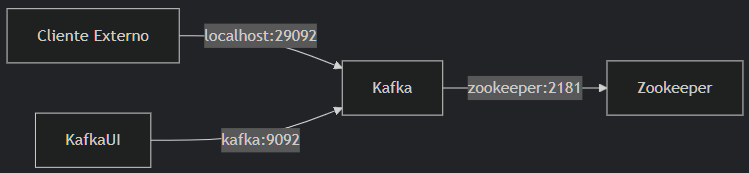
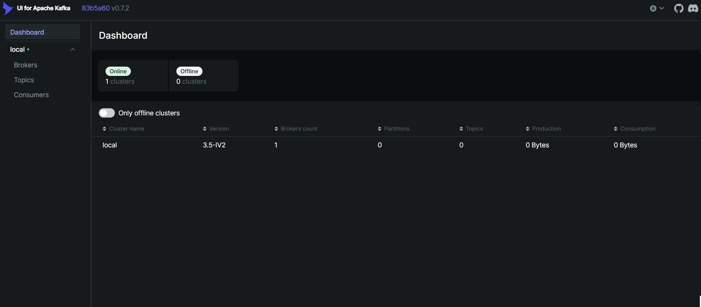

# Configuración de Apache Kafka en Contenedores


Esta guía proporciona instrucciones detalladas para instalar y desplegar Apache Kafka en un contenedor Docker, asegurando compatibilidad en todas las plataformas (Linux, macOS, Windows, incluyendo WSL).

## Tabla de Contenidos

- [Configuración de Apache Kafka en Contenedores](#configuración-de-apache-kafka-en-contenedores)
  - [Tabla de Contenidos](#tabla-de-contenidos)
  - [Prerrequisitos](#prerrequisitos)
  - [Paso 1: Crear un Archivo Docker Compose](#paso-1-crear-un-archivo-docker-compose)
  - [Paso 2: Desplegar Kafka con Docker Compose](#paso-2-desplegar-kafka-con-docker-compose)
    - [Gestión rápida con Makefile](#gestión-rápida-con-makefile)
  - [Paso 3: Verificar el Despliegue](#paso-3-verificar-el-despliegue)
  - [Paso 4: Integración con Herramientas de Kafka](#paso-4-integración-con-herramientas-de-kafka)
  - [Paso 5: Gestión de los Contenedores de Kafka](#paso-5-gestión-de-los-contenedores-de-kafka)
  - [Consejos para Compatibilidad Multiplataforma](#consejos-para-compatibilidad-multiplataforma)
  - [Resolución de Problemas](#resolución-de-problemas)
  - [Recursos Adicionales](#recursos-adicionales)
  - [Volver a su ficha](#volver-a-su-ficha)

## Prerrequisitos

Antes de comenzar, asegúrate de lo siguiente:

- **Docker** está instalado y en ejecución.
- **Docker Compose** está instalado (se recomienda la versión 2.29.x o superior). Verifica con:

> Puedes utilizar el script de `docker_install.sh` de la carpeta `/resources` para instalar ambas cosas en WSL/Ubuntu.

- Tienes suficiente espacio en disco para los logs de Kafka (al menos 1GB para pruebas).
- Los puertos `2181` (Zookeeper), `9092` (broker de Kafka) y `29092` (acceso externo) están disponibles en tu máquina.

## Paso 1: Crear un Archivo Docker Compose

Crea un archivo `docker-compose.yml` para definir un clúster de Kafka de un solo nodo con Zookeeper, **configurando las propiedades de Kafka directamente mediante variables de entorno**. Tambien puedes usar el fichero pregenerado de la carpeta `resources/kafka/` Este setup garantiza consistencia en todas las plataformas.

docker-compose.yml

```yml
services:
  zookeeper:
    image: confluentinc/cp-zookeeper:7.5.0
    container_name: zookeeper
    ports:
      - "2181:2181"
    environment:
      ZOOKEEPER_CLIENT_PORT: 2181
      ZOOKEEPER_TICK_TIME: 2000
    healthcheck:
      test: ["CMD", "echo", "ru", "|", "nc", "localhost", "2181"]
      interval: 10s
      timeout: 5s
      retries: 5
    volumes:
      - zookeeper_data:/var/lib/zookeeper

  kafka:
    image: confluentinc/cp-kafka:7.5.0
    container_name: kafka
    depends_on:
      zookeeper:
        condition: service_healthy
    ports:
      - "9092:9092"   # Para otros contenedores (Kafka UI)
      - "29092:29092" # Para el host local (kcat, etc)
    environment:
      KAFKA_BROKER_ID: 1
      KAFKA_ZOOKEEPER_CONNECT: zookeeper:2181

      KAFKA_LISTENER_SECURITY_PROTOCOL_MAP: PLAINTEXT:PLAINTEXT,HOST:PLAINTEXT
      KAFKA_LISTENERS: PLAINTEXT://0.0.0.0:9092,HOST://0.0.0.0:29092
      KAFKA_ADVERTISED_LISTENERS: PLAINTEXT://kafka:9092,HOST://localhost:29092
      KAFKA_INTER_BROKER_LISTENER_NAME: PLAINTEXT

      KAFKA_OFFSETS_TOPIC_REPLICATION_FACTOR: 1
      KAFKA_TRANSACTION_STATE_LOG_REPLICATION_FACTOR: 1
      KAFKA_TRANSACTION_STATE_LOG_MIN_ISR: 1
    healthcheck:
      test: ["CMD", "kafka-topics", "--bootstrap-server", "kafka:9092", "--list"]
      interval: 10s
      timeout: 5s
      retries: 5
    volumes:
      - kafka_data:/var/lib/kafka/data

  kafka-ui:
    image: provectuslabs/kafka-ui:latest
    container_name: kafka-ui
    depends_on:
      kafka:
        condition: service_healthy
    ports:
      - "8080:8080"
    environment:
      KAFKA_CLUSTERS_0_NAME: local
      KAFKA_CLUSTERS_0_BOOTSTRAPSERVERS: kafka:9092
      KAFKA_CLUSTERS_0_ZOOKEEPER: zookeeper:2181

volumes:
  kafka_data:
  zookeeper_data:
```

- **Explicación**:
  - **Imágenes**: Usa `confluentinc/cp-zookeeper:7.5.0` para Zookeeper, `confluentinc/cp-kafka:7.5.0` para Kafka y `provectuslabs/kafka-ui:latest` para Kafka UI.
  - **Nombres de contenedor**: Asigna nombres fijos (`zookeeper`, `kafka`) para referencia sencilla.
  - **Puertos**:
    - Zookeeper: Mapea el `2181` para conexiones de cliente.
    - Kafka: Mapea el `9092` para comunicación interna y `29092` para acceso externo desde el host.
    - Kafka UI: Mapea el `8080` para acceso externo desde el host.
  - **Variables de entorno**:
    - KAFKA_BROKER_ID: Identificador único del broker
    - KAFKA_ZOOKEEPER_CONNECT: Conexión a Zookeeper
    - KAFKA_LISTENER_SECURITY_PROTOCOL_MAP: Configura los protocolos de seguridad
    - KAFKA_LISTENERS: Configura interfaces de escucha
    - KAFKA_ADVERTISED_LISTENERS: Configura listeners anunciados
    - KAFKA_INTER_BROKER_LISTENER_NAME: Configura el listener interno
    - KAFKA_OFFSETS_TOPIC_REPLICATION_FACTOR: Replicación para topics internos
    - KAFKA_TRANSACTION_STATE_LOG_REPLICATION_FACTOR: Replicación para topics de transacciones
    - KAFKA_TRANSACTION_STATE_LOG_MIN_ISR: Minimo de replicas para topics de transacciones
  - **Volúmenes**:
    - `zookeeper_data`: Persisten datos de Zookeeper.
    - `kafka_data`: Persiste los logs de Kafka.
  - **Healthcheck**: Verifica que Kafka esté operativo listando los topics.
  - **Depends On**: Garantiza que Kafka arranque después de Zookeeper.
  - **Flujo de Comunicación**:
    - 

## Paso 2: Desplegar Kafka con Docker Compose

Inicia los contenedores de Zookeeper y Kafka usando Docker Compose.

```bash
docker-compose up -d
```

- **Explicación**:
  - El flag `-d` ejecuta los contenedores en segundo plano.
  - Verifica que los contenedores estén en ejecución:

    ```bash
    docker ps
    ```

    Deberías ver dos contenedores: `zookeeper` y `kafka`.

---

### Gestión rápida con Makefile

En la carpeta `resources/kafka/` tienes un `Makefile` preparado para gestionar Kafka fácilmente:

```makefile
KAFKA_COMPOSE=docker-compose.yml

up:
    docker compose -f $(KAFKA_COMPOSE) up -d

down:
    docker compose -f $(KAFKA_COMPOSE) down

restart:
    docker compose -f $(KAFKA_COMPOSE) restart

logs:
    docker compose -f $(KAFKA_COMPOSE) logs -f
```

Ejecuta los siguientes comandos desde esa carpeta:

- Levantar Kafka:

  ```bash
  make up
  ```

- Parar Kafka:

  ```bash
  make down
  ```

- Reiniciar Kafka:

  ```bash
  make restart
  ```

- Ver logs:

  ```bash
  make logs
  ```

> **Nota:** Para usar los comandos `make`, asegúrate de tener instalado el paquete `make`.
> Puedes instalarlo en sistemas basados en Debian/Ubuntu con:

```bash
sudo apt install make
```

---

## Paso 3: Verificar el Despliegue

1. **Revisar los logs de los contenedores**:

   Asegúrate de que Zookeeper y Kafka estén funcionando sin errores:

   ```bash
   docker logs zookeeper
   docker logs kafka
   ```

2. **Probar la conectividad de Kafka**:
   Usa las herramientas de línea de comandos dentro del contenedor para crear y listar un topic:

   ```bash
   docker exec -it kafka kafka-topics --bootstrap-server localhost:9092 --create --topic test-topic --partitions 1 --replication-factor 1
   docker exec -it kafka kafka-topics --bootstrap-server localhost:9092 --list
   ```

   Deberías ver `test-topic` en la salida.

3. **Probar acceso externo**:
   Desde el host, usa `kcat` para verificar la conectividad. Instala `kcat`:

   ```bash
   sudo apt install -y kcat
   ```

   Produce un mensaje al topic:

   ```bash
   echo "mensaje de prueba" | kcat -b localhost:29092 -t test-topic -P
   ```

   Consume el mensaje:

   ```bash
   kcat -b localhost:29092 -t test-topic -C
   ```

   Verificar en Kafka UI:
   Una vez que los contenedores estén en ejecución, abre tu navegador y accede a:

   - Abre [http://localhost:8080/](http://localhost:8080/)
  
   - Navega a "Topics" y verifica que puedes ver el topic creado
   - En "Messages", prueba a enviar un mensaje directamente desde la interfaz
  

## Paso 4: Integración con Herramientas de Kafka

Kafka soporta varios clientes (por ejemplo, `confluent-kafka` para Python, clientes Java de Kafka). Ejemplo con Python:

1. Instala `confluent-kafka`:

   ```bash
   pip install confluent-kafka
   ```

2. Produce y consume mensajes:

   ```python
   from confluent_kafka import Producer, Consumer, KafkaError

   # Productor
   producer = Producer({'bootstrap.servers': 'localhost:29092'})
   producer.produce('test-topic', value='¡Hola, Kafka!')
   producer.flush()

   # Consumidor
   consumer = Consumer({
       'bootstrap.servers': 'localhost:29092',
       'group.id': 'test-group',
       'auto.offset.reset': 'earliest'
   })
   consumer.subscribe(['test-topic'])
   msg = consumer.poll(1.0)
   if msg and not msg.error():
       print(f"Recibido: {msg.value().decode('utf-8')}")
   consumer.close()
   ```

## Paso 5: Gestión de los Contenedores de Kafka

- **Detener los contenedores**:

  ```bash
  docker-compose down
  ```

  Esto detiene y elimina los contenedores pero preserva los volúmenes.

- **Reiniciar los contenedores**:
  
  ```bash
  docker-compose up -d
  ```

- **Eliminar volúmenes (si es necesario)**:
  Para borrar todos los datos de Kafka y Zookeeper:

  ```bash
  docker volume rm kafka_data zookeeper_data
  ```

## Consejos para Compatibilidad Multiplataforma

- **Volúmenes de Docker**: Los volúmenes `zookeeper_data`, `zookeeper_log` y `kafka_data` aseguran persistencia de datos entre reinicios y son compatibles con todas las plataformas soportadas por Docker.
- **Conflictos de puertos**: Si los puertos `2181`, `9092` o `29092` están en uso, modifica el `docker-compose.yml` para usar otros puertos (ejemplo: `2182:2181`, `9093:9092`).
- **Notas para WSL**: En WSL, accede a Kafka vía `localhost:29092` desde Windows. Asegúrate de que Docker Desktop esté integrado con WSL2 o usa la instalación manual de Docker.

## Resolución de Problemas

- **Los contenedores no inician**:
  Revisa los logs:

  ```bash
  docker logs zookeeper
  docker logs kafka
  ```

  Problemas comunes: conflictos de puertos, memoria insuficiente o Zookeeper no listo antes de Kafka.

- **No se puede conectar a Kafka**:
  Asegúrate de usar `localhost:29092` para acceso externo. Para acceso interno en la red Docker, usa `kafka:9092`.

- **Los datos no persisten**:
  Verifica que existan los volúmenes:

  ```bash
  docker volume ls | grep kafka
  ```

## Recursos Adicionales

- [Documentación Docker de Confluent Kafka](https://docs.confluent.io/platform/current/installation/docker/)
- [Documentación de Apache Kafka](https://kafka.apache.org/documentation/)
- [Guía de Modo KRaft](https://kafka.apache.org/documentation/#kraft)

## Volver a su ficha

[Volver a la ficha de Kafka](../tecnologias/kafka.md)
