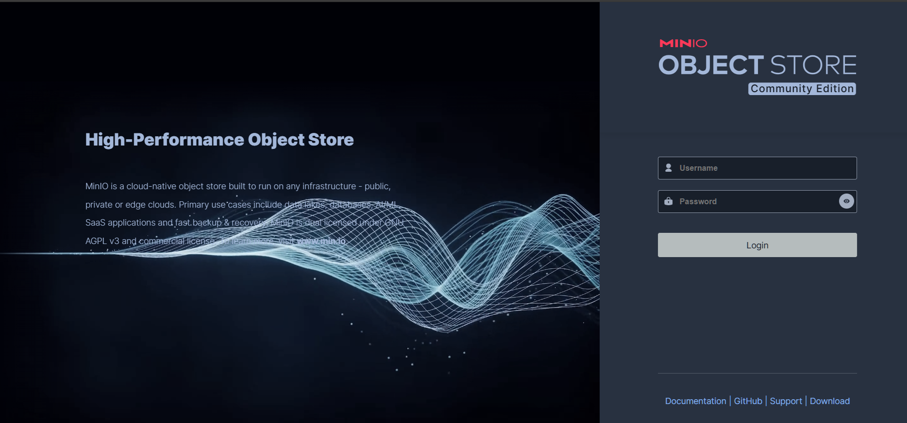
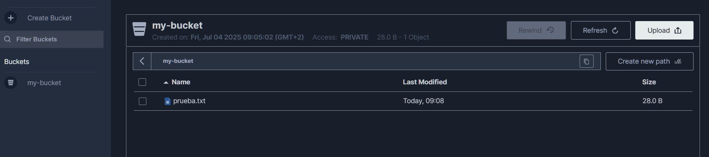

# Configuración de MinIO


Este documento describe cómo instalar y configurar MinIO con contenedores.

## Tabla de Contenidos

- [Configuración de MinIO](#configuración-de-minio)
  - [Tabla de Contenidos](#tabla-de-contenidos)
  - [Prerequisitos](#prerequisitos)
  - [Paso 1: Crear un archivo Docker Compose](#paso-1-crear-un-archivo-docker-compose)
  - [Paso 2: Desplegar MinIO con Docker Compose](#paso-2-desplegar-minio-con-docker-compose)
    - [Gestión rápida con Makefile](#gestión-rápida-con-makefile)
  - [Paso 3: Verificar el despliegue](#paso-3-verificar-el-despliegue)
  - [Paso 4: Usar el Cliente MinIO (mc) para Gestionar Buckets](#paso-4-usar-el-cliente-minio-mc-para-gestionar-buckets)
  - [Paso 5: Gestión del contenedor de MinIO](#paso-5-gestión-del-contenedor-de-minio)
  - [Consejos para compatibilidad multiplataforma](#consejos-para-compatibilidad-multiplataforma)
  - [Resolución de problemas](#resolución-de-problemas)
  - [Volver a su ficha](#volver-a-su-ficha)

## Prerequisitos

Antes de comenzar, asegúrate de lo siguiente:

- **Docker** está instalado y en ejecución.
- **Docker Compose** está instalado (se recomienda la versión 2.29.x o superior). Verifica con:

> Puedes utilizar el script de `docker_install.sh` de la carpeta `/resources` para instalar ambas cosas en WSL/Ubuntu.

- Tienes suficiente espacio en disco para el almacenamiento de datos de MinIO (al menos 1GB para pruebas).
- Los puertos `9000` (API) y `9001` (consola) están disponibles en tu máquina anfitriona.

## Paso 1: Crear un archivo Docker Compose

Crea un archivo `docker-compose.yml` para definir el servicio de MinIO, incluyendo puertos, variables de entorno, volúmenes y el comando para ejecutar el servidor. Tambien puedes usar el fichero pregenerado de la carpeta `resources/minio/` Este enfoque asegura consistencia entre plataformas.

minio-compose.yml

```yml
services:
  minio:
    image: minio/minio:latest
    container_name: minio
    ports:
      - "9000:9000"
      - "9001:9001"
    environment:
      - MINIO_ROOT_USER=admin
      - MINIO_ROOT_PASSWORD=admin123
    volumes:
      - minio_data:/data
    command: server /data --console-address ":9001"
    healthcheck:
      test: ["CMD", "curl", "-f", "http://localhost:9000/minio/health/live"]
      interval: 30s
      timeout: 20s
      retries: 3

  minio-client:
    image: minio/mc:latest
    container_name: minio_client
    depends_on:
      minio:
        condition: service_healthy
    entrypoint: ["/bin/sh", "-c"]
    command: >
      "mc alias set myminio http://minio:9000 admin admin123;
       tail -f /dev/null"
    volumes:
      - minio_client_data:/root/.mc

volumes:
  minio_data:
  minio_client_data:
```

- **Explicación**:
  - **Imagen**: Usa `minio/minio:latest` para la versión más reciente de MinIO y `minio/mc:latest` para el cliente MinIO.
  - **Nombre del contenedor**: Asigna nombres fijos `minio` y `minio_client` para referencia sencilla.
  - **Puertos**: Mapea los puertos `9000` (API) y `9001` (consola) del host a los del contenedor MinIO.
  - **Variables de entorno**: Establece credenciales por defecto (`admin`/`admin123`). **Cámbialas en producción** por seguridad.
  - **Volúmenes**: Persiste los datos en volúmenes Docker llamados `minio_data` y `minio_client_data` para evitar pérdida de datos.
  - **Comando**: Ejecuta el servidor MinIO con `/data` como directorio de almacenamiento y la consola en el puerto `9001`. El cliente configura un alias `myminio` y permanece activo.
  - **Healthcheck**: Comprueba periódicamente si MinIO está en funcionamiento consultando su endpoint de salud.
  - **Dependencia**: El cliente espera a que el servidor MinIO esté saludable antes de iniciarse.

## Paso 2: Desplegar MinIO con Docker Compose

Inicia los contenedores de MinIO y el cliente usando Docker Compose. Este comando descarga las imágenes (si no están descargadas), crea los volúmenes y arranca los servicios.

```bash
docker-compose up -d
```

- **Explicación**:
  - El flag `-d` ejecuta los contenedores en segundo plano (modo detach).
  - Verifica que los contenedores estén en ejecución:

    ```bash
    docker ps
    ```

    Deberías ver dos contenedores: `minio` con los puertos `9000` y `9001` mapeados, y `minio_client`.

### Gestión rápida con Makefile

En la carpeta `resources/minio/` tienes un `Makefile` preparado para gestionar MinIO fácilmente:

```makefile
MINIO_COMPOSE=docker-compose.yml

up:
    docker compose -f $(MINIO_COMPOSE) up -d

down:
    docker compose -f $(MINIO_COMPOSE) down

restart:
    docker compose -f $(MINIO_COMPOSE) restart

logs:
    docker compose -f $(MINIO_COMPOSE) logs -f
```

Ejecuta los siguientes comandos desde esa carpeta:

- Levantar MinIO:

  ```bash
  make up
  ```

- Parar MinIO:

  ```bash
  make down
  ```

- Reiniciar MinIO:

  ```bash
  make restart
  ```

- Ver logs:

  ```bash
  make logs
  ```

> **Nota:** Para usar los comandos `make`, asegúrate de tener instalado el paquete `make`.
> Puedes instalarlo en sistemas basados en Debian/Ubuntu con:

```bash
sudo apt install make
```

## Paso 3: Verificar el despliegue

1. **Comprobar el estado de MinIO**:
   Asegúrate de que el servicio MinIO está en ejecución:

   ```bash
   docker logs minio
   ```

   Busca un mensaje como:

   ```txt
   API: http://172.18.0.2:9000  http://127.0.0.1:9000
   WebUI: http://172.18.0.2:9001 http://127.0.0.1:9001
   ```

2. **Acceder a la consola de MinIO**:
   Abre un navegador y navega a:

   ```txt
   http://localhost:9001
   ```

   

   Inicia sesión con las credenciales:
   - **Usuario**: `admin`
   - **Contraseña**: `admin123`
   Deberías ver la interfaz web de MinIO para gestionar buckets y objetos.

3. **Probar la API**:
   Usa `curl` para verificar el endpoint de la API:

   ```bash
   curl http://localhost:9000/minio/health/live
   ```

   Si MinIO está en ejecución, esto no debería devolver errores.

## Paso 4: Usar el Cliente MinIO (mc) para Gestionar Buckets

El contenedor `minio_client` permite interactuar con el servidor MinIO desde la línea de comandos usando el cliente `mc`. Puedes crear y gestionar buckets, subir archivos y más.

1. **Acceder al contenedor del cliente**:
   Abre una shell interactiva en el contenedor `minio_client`:

   ```bash
   docker exec -it minio_client /bin/sh
   ```

2. **Listar buckets existentes**:
   Dentro del contenedor, ejecuta:

   ```bash
   mc ls myminio
   ```

   - **Explicación**: Este comando lista todos los buckets en el servidor MinIO bajo el alias `myminio` (configurado en el `docker-compose.yml` para conectar a `http://minio:9000`). Si no hay buckets, la salida estará vacía.

3. **Crear un nuevo bucket**:
   Crea un bucket llamado `my-bucket`:

   ```bash
   mc mb myminio/my-bucket
   ```

   - **Explicación**: El comando `mc mb` crea un nuevo bucket en el servidor MinIO. Un bucket es un contenedor lógico para almacenar objetos (archivos) en MinIO, similar a una carpeta de nivel superior. La salida debería ser:

     ```txt
     Bucket created successfully `myminio/my-bucket`.
     ```

4. **Verificar la creación del bucket**:
   Vuelve a listar los buckets para confirmar:

   ```bash
   mc ls myminio
   ```

   Deberías ver algo como:

   ```txt
   [2025-07-04 09:00:00 CEST]     0B my-bucket/
   ```

   También puedes verificar en la consola web de MinIO (`http://localhost:9001`) navegando a la sección de buckets, donde `my-bucket` debería aparecer.

5. **Subir un archivo de prueba (opcional)**:
   Para confirmar que el bucket funciona, crea un archivo de prueba y súbelo:

   ```bash
   echo "¡Hola, MinIO!" > prueba.txt
   mc cp prueba.txt myminio/my-bucket/
   ```

   Luego, verifica los objetos en el bucket:

   ```bash
   mc ls myminio/my-bucket
   ```

   Espera una salida como:

   ```txt
   [2025-07-04 09:05:00 CEST]    28B prueba.txt
   ```

   

- **Propósito**:
  - Los buckets son esenciales para organizar y almacenar datos en MinIO. Crear un bucket como `my-bucket` te permite empezar a guardar objetos (archivos) que pueden ser accedidos a través de la API de MinIO o la consola web.
  - El cliente `mc` facilita la gestión del almacenamiento desde la línea de comandos, ideal para automatización o tareas rápidas.

## Paso 5: Gestión del contenedor de MinIO

- **Detener los contenedores**:

  ```bash
  docker-compose down
  ```

  Esto detiene y elimina los contenedores pero conserva los volúmenes `minio_data` y `minio_client_data`.

- **Reiniciar los contenedores**:

  ```bash
  docker-compose up -d
  ```

- **Eliminar los volúmenes (si es necesario)**:
  Para borrar todos los datos de MinIO:

  ```bash
  docker volume rm minio_minio_data minio_minio_client_data
  ```

## Consejos para compatibilidad multiplataforma

- **Volúmenes de Docker**: Los volúmenes `minio_data` y `minio_client_data` aseguran la persistencia de datos entre reinicios de contenedores y son compatibles con todas las plataformas soportadas por Docker.
- **Notas para WSL**: Si usas WSL, asegúrate de que Docker Desktop esté configurado para integrarse con WSL2, o usa la instalación de Docker del script anterior. Accede a la consola vía `http://localhost:9001` desde el host de Windows, no desde la IP interna de WSL.

## Resolución de problemas

- **El contenedor no inicia**:
  Revisa los logs:

  ```bash
  docker logs minio
  ```

  Problemas comunes: conflictos de puertos, credenciales incorrectas o permisos insuficientes.

- **No se puede acceder a la consola**:
  Asegúrate de acceder a `http://localhost:9001` desde la máquina anfitriona. Si usas WSL, verifica la integración de Docker Desktop con WSL o usa `http://127.0.0.1:9001`.

- **Los datos no persisten**:
  Verifica que los volúmenes `minio_data` y `minio_client_data` existan:

  ```bash
  docker volume ls | grep minio
  ```

## Volver a su ficha

[Volver a la ficha de MinIO](../tecnologias/minio.md)
